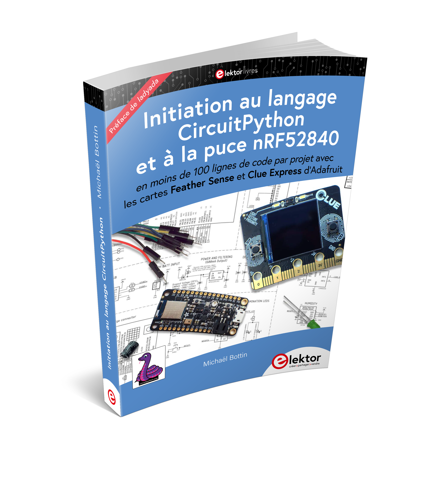

# nRF52840-CircuitPython

Ressources pour le livre édité chez Elektor : "Initiation au langage CircuitPython et à la puce nRF52840"

https://www.elektor.fr/initiation-au-langage-circuitpython-et-a-la-puce-nrf52840

Problème d'arborescence pour le moment : récupérer simplement les fichiers zip de chaque chapitre pour avoir
l'ensemble des fichiers utiles !

